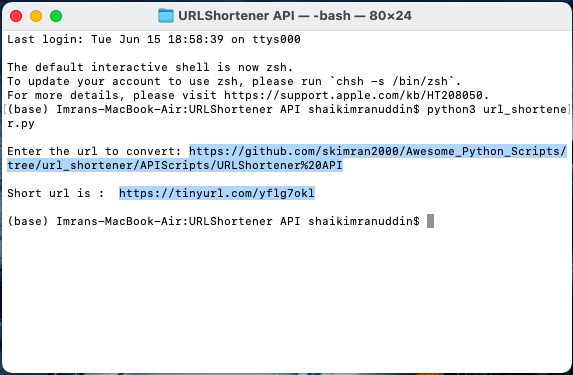
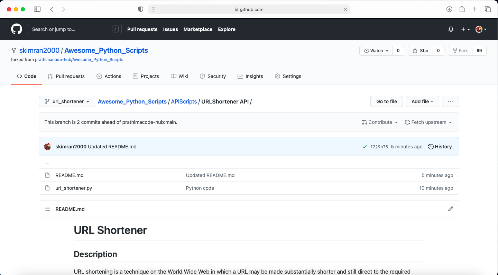

  
# URL Shortener

## Description

URL shortening is a technique on the World Wide Web in which a URL may be made substantially shorter and still direct to the required page. This is achieved by using a redirect which links to the web page that has a long URL.

### How it is done?

This is achieved by using a redirect which links to the web page that has a long URL.
In this program the long URL is taken as input and is shortened by using tinyurl API.
In make_tiny(url) function encoding of url and appending it to API is done and then we open request_url using urlopen. Then we convert the response to UTF-8, since urlopen() returns a stream of bytes rather than a string.

## Library imported :

 __future__  ~  is a pseudo-module which programmers can use to enable new language 					   features which are not compatible with the current interpreter.  
contextlib  ~  defines ContextManager class whose object properly manages the resources 			   within a program. The file object supports ContextManager API.  
urlib	    ~  It is a package that collects several modules for working with URLs.  
sys			~  provides various functions and variables that are used to manipulate 				   different parts of the Python runtime environment.  

## Output :
Output Screenshot:  

Short URL website Screenshot:

## Author : Shaik Imranuddin 

